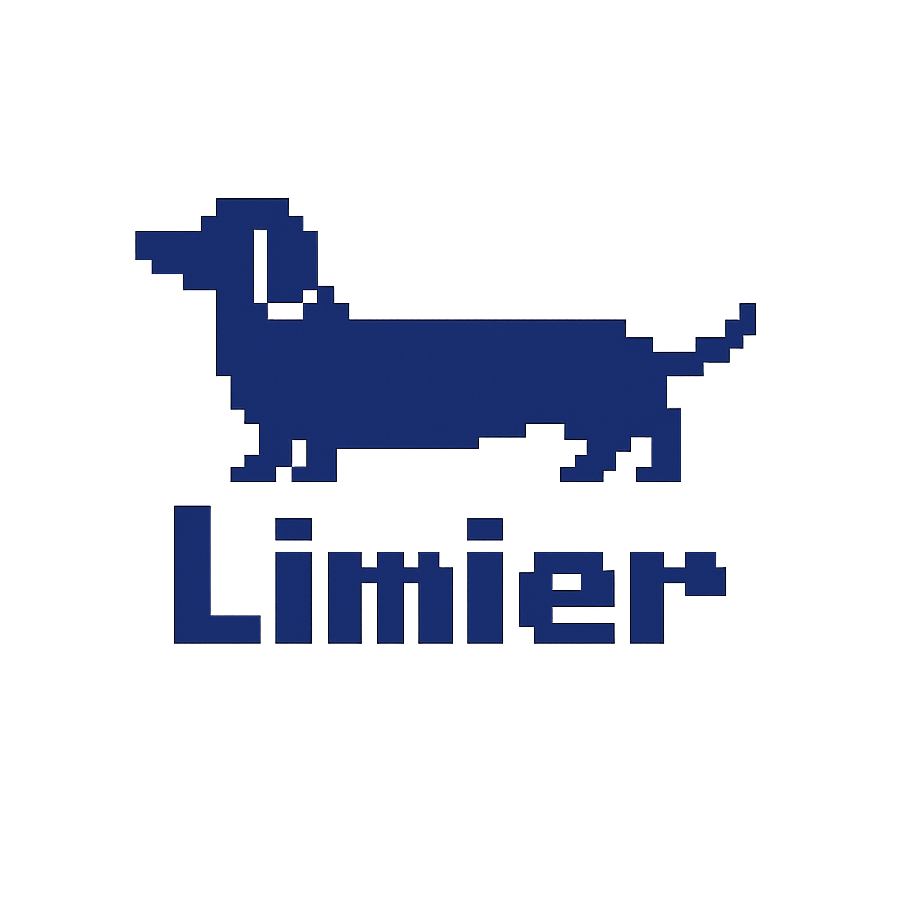

<p align="center">
  
</p>

# Limier

Limier is a fixture-based dependency behavior review tool. It compares a baseline package version with a candidate version, captures the behavior each one triggers in a controlled sample application, and turns the diff into one of four reviewer-facing outcomes:

- `good_to_go`
- `needs_review`
- `block`
- `rerun`

Limier is intentionally narrow. It is for suspicious or exploit-like dependency behavior such as new process execution, unexpected shelling out, changed install-time behavior, or other observable runtime drift. It is not a general application security scanner and it does not try to find `SQLi`, `XSS`, CSRF, or broad secure-coding flaws in the fixture itself.

Kernel telemetry is Linux-only and currently requires `bpftrace`. Telemetry defaults to `required`; if Limier cannot start or complete capture, the run becomes inconclusive so process-coverage gaps are never hidden. Use `telemetry.mode: off` for an output-only comparison that always requires human review.

## Documentation

The documentation in [`docs/`](./docs/) is the main entry point for setup and usage.

- [Overview](./docs/index.md)
- [Getting Started](./docs/guide/getting-started.md)
- [Use In CI](./docs/guide/ci-and-deploy.md)
- [Review Your Own Project](./docs/guide/review-your-own-project.md)
- [CLI Reference](./docs/reference/cli.md)

## Quick Start

Run the repository-owned npm sample:

```sh
sh ./examples/ci/run-sample.sh
```

That sample uses:

- fixture: `fixtures/npm-app`
- scenario: `scenarios/npm.yml`
- rules: `rules/default.yml`

The script writes:

- `out/limier/report.json`
- `out/limier/summary.md`
- `out/limier/build-summary.md`
- `out/limier/evidence/`

## GitHub Actions

For pull request dependency review, use the packaged action after checking out the repository:

```yaml
- uses: actions/checkout@v6
  with:
    fetch-depth: 0

- uses: room215/limier-action@v1
```

The action runs `limier ci github`, maps Dependabot metadata, publishes the build summary, and uploads `out/limier` as an artifact.

## Development

Build and test with the standard Go toolchain:

```sh
go build ./...
go test ./...
go vet ./...
gofmt -w .
```
